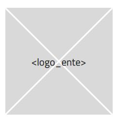
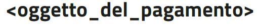


|AGID_logo_carta_intestata-02.png|

+--------------------------------------------------------+
| **L’Avviso di pagamento analogico nel sistema pagoPA** |
|                                                        |
| *Guida Tecnica*                                        |
|                                                        |
| **Versione** **2.1 -** **maggio 2018**                 |
+--------------------------------------------------------+

1. istruzioni per la produzione
===============================

`In Allegato 1 - (Modello di avviso in formato PDF) <Allegato_1_Modello_di_avviso_di_pagamento_v2.1.pdf>`_ è fornito il
modello di avviso di pagamento utilizzabile sia per il pagamento in
unica soluzione sia per il pagamento dello stesso importo frazionato in
rate. Ogni pagina del modello è completamente riproducibile in un foglio
di formato A4.

`L’Allegato 2 - (Specifiche Tecniche) <Allegato_2_Specifiche_Tecniche_v2.1.PDF>`_ fornisce le indicazioni
specifiche per la produzione del documento in tutte le casistiche
previste.

1.1 Pagamento in Unica Soluzione
--------------------------------

La prima pagina del modello, che va comunque predisposta, è logicamente
suddivisa in sei zone orizzontali, ognuna delle quali destinata a
fornire all'utilizzatore finale le informazioni specifiche elencate di
seguito:

zona a) Testata:

-  Logo pagoPA

-  Logo EC

zona b) Oggetto del pagamento

zona c) Soggetti interessati dal pagamento

-  Ente creditore beneficiario

-  Destinatario dell’avviso (soggetto Pagatore)

zona d) Informazioni sul pagamento

-  Quanto e quando pagare

-  Dove pagare

zona e) Zona tecnica per i pagamenti presso Banche e altri canali

zona f) Zona tecnica per i pagamenti presso Poste Italiane (da utilizzare
obbligatoriamente nel caso in cui l’EC disponga di un conto postale)

Il modello, fornito in formato aperto (PDF), è auto esplicativo nel
senso che fornisce in modo esauriente e univoco tutti i dati utili alla
stampa e in particolare:

-  Posizione, dimensione, colore e altre caratteristiche degli elementi
   grafici

-  Posizione, font, dimensione e altre caratteristiche degli elementi
   testuali

Per la corretta visualizzazione del modello PDF occorre aver installato
i seguenti font:

+-----------------------+-----------------------+-----------------------+
| **Famiglia**          | **Variante**          | **Url**               |
+=======================+=======================+=======================+
| Roboto Mono           | Bold                  | `https://fonts.google |
|                       |                       | .com/specimen/Roboto+ |
|                       |                       | Mono <https://fonts.g |
|                       |                       | oogle.com/specimen/Ro |
|                       |                       | boto+Mono>`__         |
+-----------------------+-----------------------+-----------------------+
| Roboto Mono           | Regular               | `https://fonts.google |
|                       |                       | .com/specimen/Roboto+ |
|                       |                       | Mono <https://fonts.g |
|                       |                       | oogle.com/specimen/Ro |
|                       |                       | boto+Mono>`__         |
+-----------------------+-----------------------+-----------------------+
| Titillium Web         | Black                 | `https://fonts.google |
|                       |                       | .com/specimen/Titilli |
|                       |                       | um+Web <https://fonts |
|                       |                       | .google.com/specimen/ |
|                       |                       | Titillium+Web>`__     |
+-----------------------+-----------------------+-----------------------+
| Titillium Web         | Bold                  | `https://fonts.google |
|                       |                       | .com/specimen/Titilli |
|                       |                       | um+Web <https://fonts |
|                       |                       | .google.com/specimen/ |
|                       |                       | Titillium+Web>`__     |
+-----------------------+-----------------------+-----------------------+
| Titillium Web         | Regular               | `https://fonts.google |
|                       |                       | .com/specimen/Titilli |
|                       |                       | um+Web <https://fonts |
|                       |                       | .google.com/specimen/ |
|                       |                       | Titillium+Web>`__     |
+-----------------------+-----------------------+-----------------------+

Gli elementi grafici e testuali (etichette) comuni a tutti gli avvisi
sono completamente definiti dal modello. Gli elementi grafici e testuali
specifici del singolo avviso sono invece rappresentati nel modello da
immagini o etichette segnaposto come da esempi in figura:

|image1|

|image2|

In entrambi i casi gli oggetti segnaposto, specifici del singolo avviso,
sono identificati nel modello da un nome univoco compreso fra parentesi
angolari in modo tale da essere referenziati `nell’Allegato 2 (Specifiche Tecniche) <Allegato_2_Specifiche_Tecniche_v2.1.PDF>`_ 
con il quale vengono integrate le indicazioni mancanti per la
stampa dell’avviso.

Per quanto riguarda i contenuti mostrati dagli oggetti testuali si
riconoscono le seguenti tipologie:

-  **Etichette comuni**: il cui contenuto è definito da AgID nel modello
   e non sono modificabili

-  **Etichette segnaposto**:

   -  **A scelta multipla**: il cui contenuto è impostato dall’EC che
      però è vincolato a scegliere da un set di alternative definite da
      AgID e non modificabili (`vedi ad esempio <pagamento_rateale> nell’Allegato2 - (Specifiche Tecniche) <Allegato_2_Specifiche_Tecniche_v2.1.PDF>`_)

   -  **A testo libero**: il cui contenuto è impostato liberamente
      dall’EC, purché la lunghezza non ecceda il numero di caratteri
      disponibili.

1.2 Pagamento rateale
---------------------

La seconda e terza pagina del modello sono da utilizzare, come pagine
aggiuntive alla prima descritta nel paragrafo precedente, qualora l'Ente
Creditore consenta di rateizzare il pagamento. In particolare il modello
raggruppa le rate per due (seconda pagina) o per tre (terza pagina) in
modo che l’EC abbia l’opportunità di stampare l’avviso per un qualsiasi
frazionamento del pagamento, minimizzando il numero di pagine stampate.

1.3 Gestione del Transitorio
----------------------------

I soggetti aderenti a pagoPA sono tenuti ad adeguarsi alle specifiche
contenute nella presente monografia entro il 1 dicembre 2018.

La data a partire dalla quale sarà possibile produrre il Bollettino PA
integrato nel nuovo “Avviso di pagamento analogico nel sistema PagoPA”
(vedi Zona tecnica per i pagamenti presso Poste Italiane) sarà
comunicata dalle stesse Poste Italiane.

.. |AGID_logo_carta_intestata-02.png| image:: media/header.png
   :width: 5.90551in
   :height: 1.30277in

